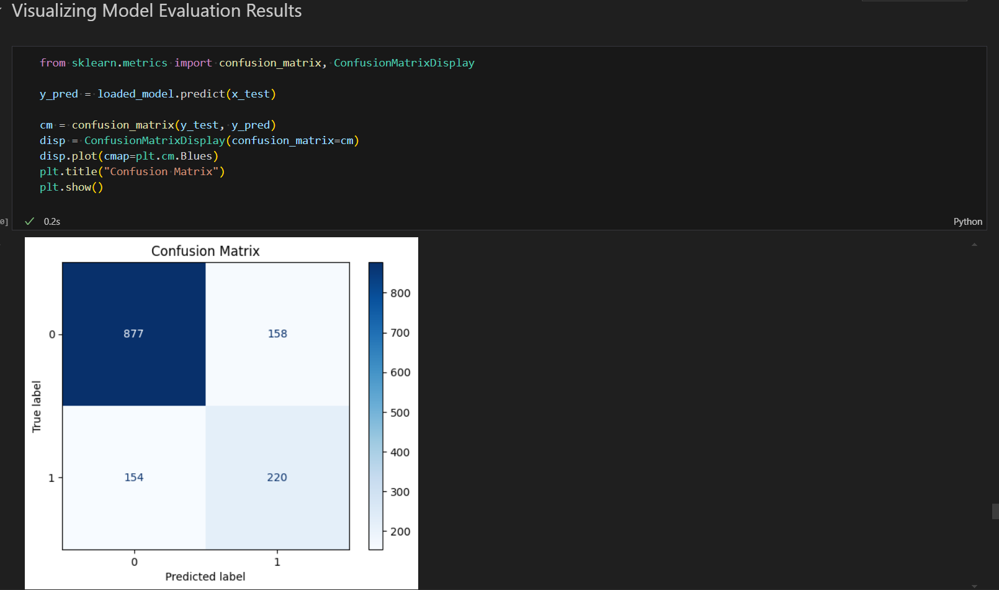
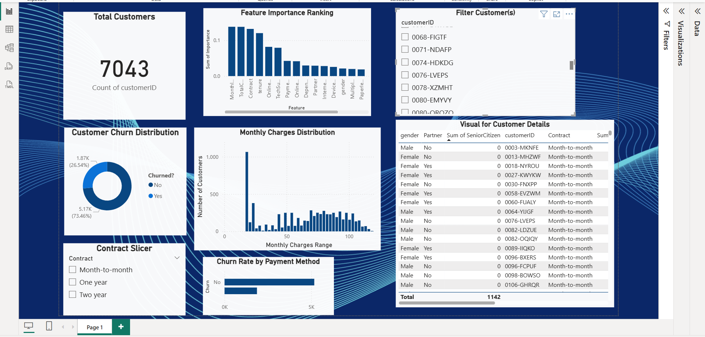
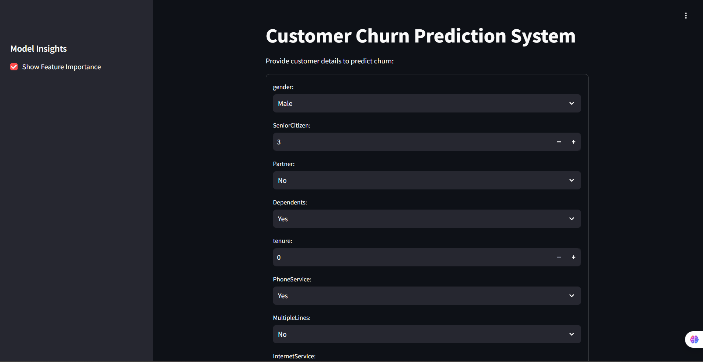
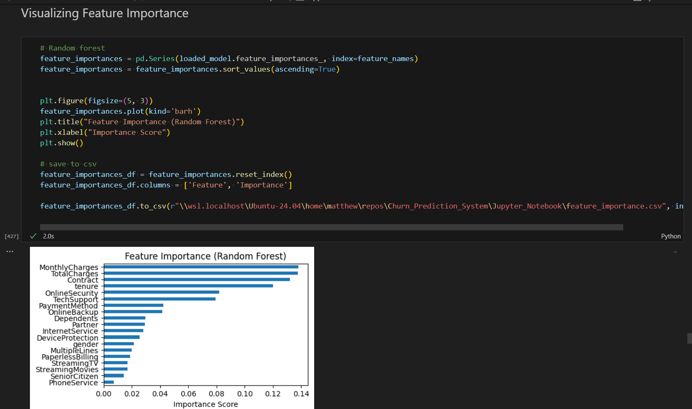

# Future_ML_02

### Customer Churn Prediction System

This projects builds a customer churn prediction system that helps businesses analyze and get some insights into customer behaviour

This project is part of my hands-on machine learning internship with **Future Interns**, where I was tasked with building a system that predicts customer churn, identifying customers likely to stop using a service. The goal is to help businesses proactively improve customer retention and reduce revenue loss.

### Project Overview

Customer churn prediction is crucial in industries such as **telecommunications, SaaS, and banking**, where customer retention is more cost-effective than acquisition. This project involves data preprocessing, training ML classification models, evaluating model performance, visualizing insights, and deploying predictions via a web app.

## Project Structure
Future_ML_02 
    -> Churn_Prediction_System
        -> Data / # Raw and processed data
        -> images / # 
        -> Jupyter_Notebook / #Jupyter notebook for EDA and model training
        -> outputs_Data_Exports / # exported data of trained models for PowerBI
        - > Churn_Prediction_Dashboard / # powerBI file
    -> README.md / # Project documentation

### What I Did

- **Explored and cleaned** customer churn dataset
- **Engineered relevant features** (contract type, payment method, service usage)
- Trained multiple ML models:  
  -  Decision Tree  
  -  Random Forest  
  -  XGBoost
- Selected the **best-performing model** based on accuracy and recall
- **Visualized churn insights** using Power BI
- Built a **Streamlit app** to make real-time predictions

###  Key Insights

- Customers on **month-to-month contracts** have a higher churn risk.
- Electronic check payment method showed the **highest churn rates**.
- Features like tenure, internet service type, and total charges were strong churn predictors.

### Model evaluation

Used multiple classification metrics to evaluate model performance:

### Streamlit App

I built an interactive web app using **Streamlit** that allows users to input customer features and receive a churn prediction in real-time.

To run the app locally:
Open Terminal and type the following
cd streamlit_app(path to the app.py file)
streamlit run app.py

## Project Screenshots

### Power BI Dashboard
Visual insights into churn drivers and customer segmentation.

### Streamlit App
Real-time churn prediction based on customer inputs.

### Feature importance 
Top features influencing customer churn.

